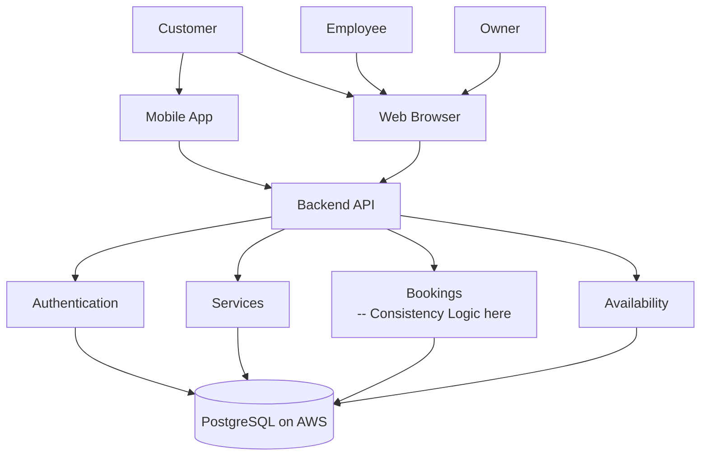

## 1. Who uses SlotSure?
-Customers 
-Employees 
-Owner

## 2.What client do they interact with?
-Customers interact with the mobile app or web browser
-Employees interact with the web browser
-Owner interacts with the web browser

## 3. What receives their request?
-Backend API receives requests from clients

## 4. What major backend components exist?
-Authentication "user signup and login"
-Services "What services the user provides"
-Bookings "Appointments tht customers can make"
-Availability "Which staffs are available at that time"
-Database "Stores users profiles"

## 5. Where is the databse?
-The databse is PostgreSQL hosted on AWS

## 6. Where should the booking consistency logic live?
-In the database and Backend API

## 7. Architecture Diagram

